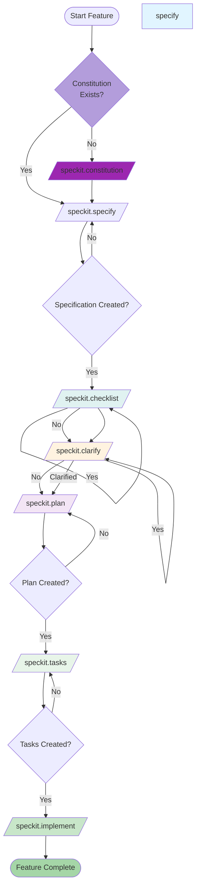
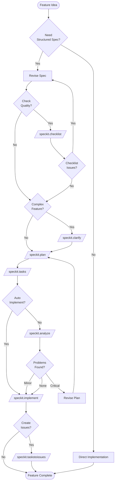

# Speckit Commands Guide

**Version**: 1.1.0
**Last Updated**: 2026-03-22
**Purpose**: Comprehensive guide to all available Speckit commands for specification-driven development

## Overview

Speckit is a specification-driven development workflow that ensures high-quality feature implementation through structured documentation, planning, and task breakdown. The workflow emphasizes clarity, validation, and traceability from requirements to implementation.

**9 Core Commands**: Constitution, Specify, Checklist, Clarify, Plan, Tasks, Implement, TasksToIssues, Analyze

## Command Workflow Diagram



## Commands

### 1. `/speckit.constitution` - Create Project Constitution

**Purpose**: Establishes or updates the project constitution with governance principles and development rules.

**When to Use**:
- **FIRST** - Before starting any feature work (one-time setup)
- When setting up governance principles for a project
- When adding or updating constitution principles
- To ensure all features align with project standards

**Input**:
- Interactive questions to establish constitution principles
- Project context and requirements
- Existing constitution (if updating)

**Outputs**:
- `.specify/memory/constitution.md` - Project constitution document
- Updated templates aligned with constitution
- Governance framework for all subsequent development

**Constitution Sections**:
1. **Core Principles** - Non-negotiable principles (e.g., Multi-Tenant Architecture First, Flowable-Native Integration)
2. **Strict Constraints** - Technology stack mandates, security constraints, performance requirements
3. **Development Workflow** - Quality gates, deployment discipline, incident response
4. **Governance** - Amendment process, compliance requirements, template synchronization

**Key Principles Example**:
- **Multi-Tenant Architecture First (NON-NEGOTIABLE)** - Absolute data isolation between tenants
- **Flowable-Native Integration (NON-NEGOTIABLE)** - Direct use of Flowable services, no abstractions
- **Test-Driven Development (MANDATORY)** - Red-Green-Refactor workflow
- **Observability & Audit Trail (NON-NEGOTIABLE)** - All workflow actions logged and traceable

**Example**:
```bash
/speckit.constitution
```

**Best Practices**:
- Run as the **very first** speckit command for new projects
- Review and approve principles with team
- Keep principles specific and enforceable
- Update constitution when major architectural decisions change
- All subsequent commands validate against this constitution

**Relationship to Other Commands**:
- **Required by**: All other speckit commands validate against constitution
- **Blocks**: `/speckit.plan` performs constitution check validation
- **Validates**: `/speckit.analyze` checks for constitution violations

**Use Cases**:
1. **New Project Setup** - Establish governance before any features
2. **Principle Addition** - Add new architectural principle to constitution
3. **Constitution Review** - Update and validate existing constitution
4. **Compliance Check** - Ensure features align with constitutional principles

---

### 2. `/speckit.specify` - Create Feature Specification

**Purpose**: Creates a comprehensive feature specification from a natural language description.

**When to Use**:
- Starting a new feature
- Defining requirements for a user story
- Documenting acceptance criteria and success metrics

**Input**:
- Natural language feature description (e.g., "I want to add user authentication")
- Feature branch name (auto-generated or manual)

**Outputs**:
- `specs/[###-feature-name]/spec.md` - Feature specification
- Git branch created for the feature
- Quality checklist for validation

**Key Sections Generated**:
- **User Scenarios & Testing**: Prioritized user stories (P1, P2, P3) with acceptance criteria
- **Requirements**: Functional requirements (FR-001, FR-002, etc.)
- **Success Criteria**: Measurable outcomes with specific metrics
- **Edge Cases**: Boundary conditions and error scenarios
- **Assumptions**: Documented defaults and context
- **Out of Scope**: Explicit exclusions

**Quality Validation**:
- Automatic checklist generation (100% coverage target)
- [NEEDS CLARIFICATION] markers for ambiguous requirements (max 3)
- Technology-agnostic success criteria
- Measurable acceptance criteria

**Example**:
```bash
/speckit.specify Add user authentication with OAuth2 and JWT tokens
```

**Best Practices**:
- Provide clear, concise feature descriptions
- Include key requirements in the initial description
- Let the spec workflow fill in gaps with informed defaults
- Review generated clarifications carefully

---

### 3. `/speckit.checklist` - Generate Custom Checklist

**Purpose**: Generates a custom quality checklist for the current feature based on user requirements and specification content.

**When to Use**:
- After `/speckit.specify` completes
- Before starting implementation to ensure quality standards
- To create validation criteria specific to your feature
- To document acceptance criteria in checklist format

**Input**:
- Feature specification: `specs/[###-feature-name]/spec.md`
- User requirements and success criteria from the spec

**Outputs**:
- Updated `spec.md` with checklist generation completion noted
- Custom checklist tailored to feature requirements
- Quality criteria based on specification content

**Process**:
1. Analyzes feature specification content
2. Generates focused checklist items based on:
   - Content quality (no implementation details, focused on user value)
   - Requirement completeness (testable, unambiguous, measurable)
   - Feature readiness (acceptance criteria, user scenarios)
   - Compliance with project standards and patterns
3. Creates checklist with pass/fail criteria
4. Outputs checklist status for tracking

**Checklist Categories**:
- **Content Quality**: No implementation details, focused on user value, written for non-technical stakeholders
- **Requirement Completeness**: No unresolved markers, testable requirements, measurable success criteria
- **Feature Readiness**: All requirements have acceptance criteria, user scenarios cover primary flows

**Quality Gates**:
- Items marked incomplete require spec updates
- Checks are designed to catch common specification issues early
- Provides clear criteria for specification readiness

**Example**:
```bash
/speckit.checklist
```

**Best Practices**:
- Use after initial specification is complete
- Review checklist items carefully
- Address incomplete items before planning
- Can be used as a pre-flight check before `/speckit.plan`
- Helps ensure specification quality before investing in planning

**Relationship to Other Commands**:
- **After**: `/speckit.specify` (requires spec to exist)
- **Before**: `/speckit.plan` (ensures spec quality before planning)
- **Optional from**: `/speckit.clarify` (can run after clarification to validate improvements)
- **Complements**: `/speckit.analyze` (checklist focuses on spec quality, analysis focuses on cross-artifact consistency)

**Use Cases**:
1. **Pre-Planning Validation**: Ensure spec is ready before investing time in planning
2. **Quality Gate**: Verify specification meets standards before team review
3. **Custom Criteria**: Generate feature-specific acceptance criteria
4. **Team Alignment**: Create shared understanding of quality standards

**Example Workflow**:
```bash
# Create specification
/speckit.specify Add user authentication with OAuth2

# Generate custom checklist
/speckit.checklist

# Review checklist and address any issues
# (manual review and updates)

# Proceed with planning when checklist passes
/speckit.plan
```

---

### 5. `/speckit.plan` - Create Implementation Plan

**Purpose**: Generates detailed implementation plan with research, design artifacts, and technical decisions.

**When to Use**:
- After specification is complete (and optionally clarified)
- Before creating task breakdown
- To research technology choices and best practices
- To design data models and interface contracts

**Input**:
- Feature specification: `specs/[###-feature-name]/spec.md`
- Project constitution: `.specify/memory/constitution.md`

**Outputs**:
- `specs/[###-feature-name]/plan.md` - Implementation plan
- `specs/[###-feature-name]/research.md` - Technology decisions (Phase 0)
- `specs/[###-feature-name]/data-model.md` - Data entities and structures (Phase 1)
- `specs/[###-feature-name]/contracts/` - Interface contracts (Phase 1)
- `specs/[###-feature-name]/quickstart.md` - Developer guide (Phase 1)
- Updated agent context (CLAUDE.md)

**Phases**:

**Phase 0: Research**
- Resolves all [NEEDS CLARIFICATION] from technical context
- Researches technology choices and best practices
- Documents decisions with rationale and alternatives
- Creates `research.md`

**Phase 1: Design & Contracts**
- Extracts entities from feature spec → `data-model.md`
- Defines interface contracts → `contracts/` directory
- Creates developer guide → `quickstart.md`
- Updates agent context with new technologies

**Constitution Check**:
- Pre-planning validation (must pass before Phase 0)
- Post-planning validation (re-check after Phase 1)
- Validates against project constitution principles
- Reports violations or passes

**Key Sections**:
- **Summary**: Technical approach overview
- **Technical Context**: Languages, frameworks, dependencies
- **Constitution Check**: Principle compliance validation
- **Project Structure**: Directory layout and file organization
- **Complexity Tracking**: Violation justification (if any)

**Example**:
```bash
/speckit.plan
```

**Best Practices**:
- Let research phase complete before design
- Review constitution check results carefully
- Update agent context for consistent AI behavior
- Keep contracts focused and testable

---

### 4. `/speckit.clarify` - Resolve Specification Ambiguities

**Purpose**: Identifies and resolves ambiguities in the specification through targeted questioning before planning.

**When to Use**:
- After `/speckit.specify` completes
- After `/speckit.checklist` (optional, to improve quality further)
- Before `/speckit.plan` (recommended but optional)
- When specification has [NEEDS CLARIFICATION] markers
- To refine requirements and reduce implementation risk

**Input**:
- Feature specification from `specs/[###-feature-name]/spec.md`
- Optional: Feature number (e.g., "for spec 002")

**Outputs**:
- Updated `spec.md` with clarifications integrated
- Clarifications session section with Q&A entries
- Relevant sections updated (requirements, edge cases, entities)

**Process**:
1. Analyzes specification for ambiguities across 8 categories
2. Asks up to 5 critical questions (one at a time)
3. Integrates answers into specification
4. Updates related sections to remove ambiguities
5. Validates after each integration

**Question Categories**:
- Functional Scope & Behavior
- Domain & Data Model
- Interaction & UX Flow
- Non-Functional Quality Attributes
- Integration & External Dependencies
- Edge Cases & Failure Handling
- Constraints & Tradeoffs
- Terminology & Consistency

**Question Format**:
- Multiple choice with 2-5 options
- Recommended option with reasoning
- Short answer format (≤5 words)
- Covers highest-impact unresolved items

**Example**:
```bash
/speckit.clarify for spec 002
```

**Best Practices**:
- Run before planning for complex features
- Answer questions thoughtfully (choices impact architecture)
- Can skip for simple features (use judgment)
- Reduces downstream rework risk

**Relationship to Other Commands**:
- **After**: `/speckit.specify` and optionally `/speckit.checklist`
- **Before**: `/speckit.plan` (ensures high-quality spec before planning)
- **Improves**: Quality of planning by reducing ambiguities
- **Validated by**: `/speckit.analyze` checks for remaining issues

---

### 6. `/speckit.tasks` - Generate Task Breakdown

**Purpose**: Creates actionable, dependency-ordered task list organized by user story.

**When to Use**:
- After implementation plan is complete
- Before starting implementation
- To organize work by user story priority
- To identify parallel execution opportunities

**Input**:
- `specs/[###-feature-name]/plan.md` (required)
- `specs/[###-feature-name]/spec.md` (required)
- Optional: `research.md`, `data-model.md`, `contracts/`, `quickstart.md`

**Outputs**:
- `specs/[###-feature-name]/tasks.md` - Detailed task breakdown

**Task Organization**:

**By User Story** (PRIMARY):
- Phase 1: Setup (shared infrastructure)
- Phase 2: Foundational (blocking prerequisites)
- Phase 3+: User stories in priority order (P1, P2, P3...)
- Final Phase: Polish & cross-cutting concerns

**Each Story Contains**:
- Goal statement
- Independent test criteria
- Implementation tasks (if tests requested: test tasks first)
- Checkpoint confirming story completion

**Task Format** (REQUIRED):
```
- [ ] [TaskID] [P?] [Story?] Description with file path
```

**Components**:
- **Checkbox**: `- [ ]` (markdown checkbox)
- **Task ID**: T001, T002, T003... (sequential)
- **[P]** marker: Parallelizable (different files, no dependencies)
- **[Story]** label: [US1], [US2], [US3] (user story mapping)
- **Description**: Clear action with exact file path

**Task Types**:
- **Setup tasks**: Dependencies, directories, configuration (no story label)
- **Foundational tasks**: Blocking infrastructure (no story label)
- **Story tasks**: User story implementation (labeled with story)
- **Polish tasks**: Documentation, optimization (no story label)

**Parallel Execution**:
- Tasks marked [P] can run in parallel
- Different files or independent components
- No blocking dependencies
- Enables faster development

**Example**:
```bash
/speckit.tasks
```

**Best Practices**:
- Follow user story priority (P1 → P2 → P3)
- Each story should be independently testable
- Include exact file paths in all tasks
- Mark parallel opportunities appropriately
- Validate format (all tasks must have checkbox + ID)

---

### 7. `/speckit.implement` - Execute Implementation Plan

**Purpose**: Executes the implementation plan by processing and executing all tasks defined in tasks.md.

**When to Use**:
- After `/speckit.tasks` has created a complete task list
- To implement the feature according to the plan
- To execute tasks with atomic commits and state tracking

**Input**:
- `specs/[###-feature-name]/tasks.md` - Task breakdown
- Plan and specification for context

**Outputs**:
- Implemented code according to tasks
- Atomic commits for each task
- Progress tracking and state management

**Key Features**:
- Wave-based parallelization of independent tasks
- Handles deviations from the plan
- Checkpoint protocols for state management
- Executes tasks in dependency order

**Example**:
```bash
/speckit.implement
```

**Best Practices**:
- Ensure tasks.md is complete before running
- Review checkpoint summaries
- Monitor atomic commits
- Verify task completion at checkpoints

**Relationship to Other Commands**:
- **After**: `/speckit.tasks` completes
- **Requires**: spec.md, plan.md, tasks.md
- **Creates**: Commits, implemented code
- **Validates**: Task execution against plan

---

### 8. `/speckit.taskstoissues` - Convert Tasks to GitHub Issues

**Purpose**: Convert existing tasks into actionable GitHub issues for the feature.

**When to Use**:
- After `/speckit.tasks` has created task breakdown
- To create GitHub issues from tasks
- To track tasks in GitHub issue tracker

**Input**:
- `specs/[###-feature-name]/tasks.md` - Task breakdown
- Repository information

**Outputs**:
- GitHub issues created from tasks
- Dependency-ordered issue creation
- Issue tracking and management

**Example**:
```bash
/speckit.taskstoissues
```

**Best Practices**:
- Use after tasks are finalized
- Review issue dependencies
- Link issues to project milestones
- Use for team collaboration

**Relationship to Other Commands**:
- **After**: `/speckit.tasks` completes
- **Optional**: Can skip if not using GitHub issues
- **Creates**: GitHub issues with dependencies
- **Maintains**: Task ordering and priorities

---

### 9. `/speckit.analyze` - Analyze Specification Quality

**Purpose**: Validates specification, plan, and tasks for consistency, coverage, and quality issues.

**When to Use**:
- After `/speckit.tasks` completes
- Before starting implementation
- To ensure specification quality
- To identify coverage gaps or inconsistencies

**Input**:
- `specs/[###-feature-name]/spec.md` (required)
- `specs/[###-feature-name]/plan.md` (required)
- `specs/[###-feature-name]/tasks.md` (required)
- `.specify/memory/constitution.md` (for compliance validation)

**Outputs**:
- Structured analysis report (markdown, no file writes)
- Coverage summary table
- Constitution alignment issues
- Unmapped tasks
- Quality metrics
- Next actions recommendations
- Optional remediation suggestions

**Analysis Categories**:

**A. Duplication Detection**
- Near-duplicate requirements
- Lower-quality phrasing for consolidation

**B. Ambiguity Detection**
- Vague adjectives (fast, scalable, secure, robust)
- Unresolved placeholders (TODO, TKTK, ???)

**C. Underspecification**
- Requirements with verbs but missing object/measurable outcome
- User stories missing acceptance criteria
- Tasks referencing undefined files/components

**D. Constitution Alignment**
- Conflicts with MUST principles (CRITICAL)
- Missing mandated sections or quality gates

**E. Coverage Gaps**
- Requirements with zero associated tasks
- Tasks with no mapped requirement/story
- Non-functional requirements not in tasks

**F. Inconsistency**
- Terminology drift (same concept, different names)
- Data entities in plan but not spec (or vice versa)
- Task ordering contradictions
- Conflicting requirements

**Severity Levels**:
- **CRITICAL**: Violates constitution MUST, missing core artifact, or zero coverage
- **HIGH**: Duplicate/conflicting requirement, ambiguous security/performance
- **MEDIUM**: Terminology drift, missing non-functional task coverage
- **LOW**: Style/wording improvements, minor redundancy

**Report Sections**:
- Findings table (up to 50 issues)
- Coverage summary table
- Constitution alignment issues
- Unmapped tasks
- Metrics (total requirements, tasks, coverage %, ambiguity count, etc.)
- Next actions (recommendations)
- Remediation offer (optional)

**Example**:
```bash
/speckit.analyze
```

**Best Practices**:
- Run before implementation to catch issues early
- Review CRITICAL and HIGH issues immediately
- Address constitution violations before proceeding
- Use remediation suggestions for improvement
- Re-run after making major changes

---

## Typical Workflow

### Standard Feature Development Flow

```mermaid
graph LR
    A[1. Constitution<br/>One-time] --> B[2. Specify]
    B --> C[3. Checklist<br/>Optional]
    C --> D[4. Clarify<br/>Optional]
    D --> E[5. Plan]
    E --> F[6. Tasks]
    F --> G[7. Validate<br/>Optional]
    G --> H[8. Implement]
    H --> I[9. Analyze<br/>Optional]

    style A fill:#b39ddb
    style B fill:#e1f5ff
    style C fill:#e0f2f1,stroke-dasharray: 5 5
    style D fill:#fff3e0,stroke-dasharray: 5 5
    style E fill:#f3e5f5
    style F fill:#e8f5e9
    style G fill:#ffe0b2,stroke-dasharray: 5 5
    style H fill:#c8e6c9
    style I fill:#fce4ec,stroke-dasharray: 5 5
```



**Complete Workflow Steps**:

**0. Project Setup (One-Time)**
- **`/speckit.constitution`** - Establish project governance principles
  - Define core architectural principles
  - Set quality standards and constraints
  - Create constitution document

**1. Feature Development**

1. **`/speckit.specify`** - Create feature specification
   - Natural language input → structured spec
   - User stories with priorities (P1, P2, P3)
   - Measurable success criteria
   - Quality checklist generated

2. **`/speckit.checklist`** (Optional but Recommended)
   - Generate custom quality checklist
   - Validate specification completeness
   - Review content quality and requirement completeness
   - Ensure spec is ready before planning

3. **`/speckit.clarify`** (Optional but Recommended)
   - Resolve ambiguities before planning
   - Up to 5 targeted questions
   - Answers integrated into spec
   - Reduces downstream rework

4. **`/speckit.plan`** - Create implementation plan
   - Phase 0: Research (technology decisions)
   - Phase 1: Design (data model, contracts, quickstart)
   - Constitution check validation
   - Agent context updated

5. **`/speckit.tasks`** - Generate task breakdown
   - Organized by user story priority
   - Each story independently testable
   - Parallel opportunities marked
   - Exact file paths included

6. **`/speckit.implement`** - Execute implementation
   - Follow task order in tasks.md
   - User stories delivered incrementally
   - Checkpoints validate completion
   - Quality gates maintained

7. **`/speckit.analyze`** (Optional but Recommended)
   - Validate spec/plan/tasks consistency
   - Check coverage gaps
   - Identify issues by severity
   - Get remediation suggestions

8. **`/speckit.taskstoissues`** (Optional)
   - Convert tasks to GitHub issues
   - For team collaboration and tracking
   - Maintains dependencies and priorities

### Workflow Decision Tree



---

## Command Quick Reference

### Core Specification Commands (Feature Development)

| Command | Purpose | Input | Output | Required? |
|---------|---------|-------|--------|-----------|
| `/speckit.constitution` | Create project constitution | Interactive questions | constitution.md | ✅ **First Command** |
| `/speckit.specify` | Create feature specification | Feature description | spec.md | ✅ Yes |
| `/speckit.checklist` | Generate custom checklist | spec.md | Custom checklist | ⚠️ Recommended |
| `/speckit.clarify` | Resolve ambiguities | spec.md | Updated spec.md | ⚠️ Recommended |
| `/speckit.plan` | Create implementation plan | spec.md, constitution.md | plan.md, research.md, data-model.md, contracts/, quickstart.md | ✅ Yes |
| `/speckit.tasks` | Generate task breakdown | plan.md, spec.md | tasks.md | ✅ Yes |
| `/speckit.implement` | Execute implementation | tasks.md, plan.md, spec.md | Implemented code | ✅ Yes |
| `/speckit.taskstoissues` | Convert tasks to GitHub issues | tasks.md | GitHub issues | ⚠️ Optional |
| `/speckit.analyze` | Analyze quality | spec.md, plan.md, tasks.md, constitution.md | Analysis report | ⚠️ Recommended |

**Total Commands**: 9 core commands for specification-driven development

---

## Artifacts Generated

### Per Feature

Each feature generates a structured directory under `specs/`:

```
specs/[###-feature-name]/
├── spec.md                 # Feature specification (from /speckit.specify)
├── plan.md                 # Implementation plan (from /speckit.plan)
├── research.md             # Technology research (from /speckit.plan)
├── data-model.md           # Data entities (from /speckit.plan)
├── contracts/              # Interface contracts (from /speckit.plan)
│   └── test-helpers.md     # Example contract
├── quickstart.md           # Developer guide (from /speckit.plan)
├── tasks.md                # Task breakdown (from /speckit.tasks)
└── checklists/             # Quality checklists
    └── requirements.md     # Spec validation (from /speckit.specify)
```

### Global

- `.specify/memory/constitution.md` - Project constitution (validated by all commands)
- `CLAUDE.md` - Agent context (updated by /speckit.plan)

---

## Best Practices

### 1. Follow the Workflow Order

**✅ DO**:
- Use commands in order: specify → checklist → clarify → plan → tasks → (analyze) → implement
- Complete each phase before moving to the next
- Review outputs at each stage

**❌ DON'T**:
- Skip to implementation without planning
- Run `/speckit.tasks` before `/speckit.plan`
- Ignore constitution check failures

### 2. Use Checklist for Quality Assurance

**✅ DO**:
- Run `/speckit.checklist` after `/speckit.specify` completes
- Review checklist items carefully
- Address incomplete items before planning
- Use checklist as pre-flight check for specification quality

**❌ DON'T**:
- Skip checklist to save time
- Ignore checklist failures
- Proceed to planning with incomplete specifications

### 3. Clarify Early

**✅ DO**:
- Run `/speckit.clarify` for complex features
- Answer clarification questions thoughtfully
- Review clarifications integrated into spec
- Use checklist to identify if clarification is needed

**❌ DON'T**:
- Proceed with ambiguous requirements
- Skip clarification to save time
- Ignore [NEEDS CLARIFICATION] markers

### 4. Validate Before Implementing

**✅ DO**:
- Run `/speckit.analyze` before coding
- Review CRITICAL and HIGH issues
- Address constitution violations immediately

**❌ DON'T**:
- Start implementing with unresolved issues
- Ignore coverage gaps
- Assume analysis will find nothing

### 5. Use Artifacts During Implementation

**✅ DO**:
- Reference spec.md for requirements
- Follow plan.md architecture decisions
- Execute tasks in tasks.md order
- Consult quickstart.md for patterns

**❌ DON'T**:
- Implement features not in spec
- Deviate from plan without discussion
- Skip tasks or reorder without reason
- Ignore file paths in tasks

---

## Troubleshooting

### Common Issues

**Issue**: `/speckit.tasks` fails with "tasks.md not found"
- **Solution**: Run `/speckit.plan` first to create required artifacts

**Issue**: `/speckit.analyze` reports "Missing required artifact"
- **Solution**: Run missing prerequisite command (specify/plan/tasks)

**Issue**: Constitution check fails
- **Solution**: Address violations in spec/plan, justify if necessary

**Issue**: Low coverage percentage in analysis
- **Solution**: Add tasks to cover unmapped requirements

**Issue**: Terminology inconsistencies
- **Solution**: Use consistent terms across spec, plan, tasks

---

## Advanced Usage

### Skipping Clarification

For simple features with clear requirements, you can skip `/speckit.clarify`:

```bash
# Simple feature - skip clarification
/speckit.specify Add logging to user service
/speckit.plan
/speckit.tasks
```

### Iterative Refinement

You can iterate on specification:

```bash
# Initial spec
/speckit.specify Add user authentication

# Refine with clarification
/speckit.clarify

# Update plan with new insights
/speckit.plan

# Generate tasks
/speckit.tasks

# Validate quality before implementation
/speckit.analyze

# Implement
/speckit.implement
```

### Multi-Feature Projects

For related features, maintain consistent terminology:

```bash
# Feature 001
/speckit.specify User authentication
/speckit.plan
/speckit.tasks
/speckit.implement

# Feature 002 (builds on 001)
/speckit.specify User profile management
/speckit.plan
/speckit.tasks
/speckit.implement

# Analyze quality before implementation
/speckit.analyze
```

---

## Integration with Development Workflow

### Continuous Integration

After task generation, integrate with CI/CD:

1. Tasks organized by user story priority
2. Each story independently testable
3. Checkpoints validate completion
4. Branch protection rules enforce test coverage

### Version Control

Recommended Git workflow:

```bash
# Feature branch created by /speckit.specify
git checkout 001-user-auth

# Create specification
/speckit.specify Add user authentication
git add specs/
git commit -m "feat: add user authentication specification"

# Generate quality checklist
/speckit.checklist
git add specs/
git commit -m "feat: add quality checklist"

# (Optional) Clarify ambiguities
/speckit.clarify
git add specs/
git commit -m "feat: resolve specification ambiguities"

# Create plan
/speckit.plan
git add specs/
git commit -m "feat: add implementation plan"

# Generate tasks
/speckit.tasks
git add specs/
git commit -m "feat: add task breakdown"

# (Optional) Analyze quality
/speckit.analyze > analysis-report.md
git add analysis-report.md
git commit -m "feat: add quality analysis"

# Implement
/speckit.implement
# Commits created automatically during implementation

# (Optional) Convert to GitHub issues
/speckit.taskstoissues
```

---

## FAQ

**Q: Which command should I run first?**
A: `/speckit.constitution` - This is the **FIRST command** to run for any new project. It establishes governance principles that all other commands validate against.

**Q: When should I use `/speckit.constitution`?**
A: Run `/speckit.constitution` as the very first step when starting a new project or when you need to establish/update project governance principles. All other speckit commands validate against this constitution.

**Q: When should I use `/speckit.checklist`?**
A: Use `/speckit.checklist` after `/speckit.specify` completes but before `/speckit.plan`. It generates a custom quality checklist to validate your specification is ready for planning. It's especially useful for ensuring specification completeness and quality before investing time in the planning phase.

**Q: What's the difference between `/speckit.checklist` and `/speckit.analyze`?**
A: `/speckit.checklist` focuses on specification quality only (content, requirements, readiness) and is used during the specification phase. `/speckit.analyze` validates consistency across all three artifacts (spec, plan, tasks) and is used after task generation. Use checklist before planning, use analyze before implementation.

**Q: Can I run `/speckit.plan` without `/speckit.clarify`?**
A: Yes, clarification is optional but recommended for complex features.

**Q: Do I need to run all commands?**
A: At minimum: constitution → specify → plan → tasks → implement. Checklist, clarify, taskstoissues, and analyze are optional but recommended.

**Q: Can I modify artifacts after generation?**
A: Yes, but validate with `/speckit.analyze` after major changes.

**Q: What if constitution check fails?**
A: Address violations or justify them in Complexity Tracking section.

**Q: How do I handle [NEEDS CLARIFICATION] markers?**
A: Run `/speckit.clarify` to resolve them through targeted questions.

**Q: Can I skip user stories?**
A: Yes, tasks are organized by priority. P1 stories can be implemented independently of P2/P3.

**Q: What if analysis finds issues?**
A: Review severity. Critical issues require resolution before implementation.

**Q: How do I update agent context?**
A: `/speckit.plan` automatically updates CLAUDE.md with new technologies.

**Q: When should I use `/speckit.taskstoissues`?**
A: Use `/speckit.taskstoissues` after `/speckit.tasks` completes if you want to create GitHub issues from tasks for team collaboration and tracking.

**Q: Can I use speckit for non-Flowable features?**
A: Yes, but constitution checks are Flowable-specific. Mark N/A appropriately.

---

## Additional Resources

- **Constitution**: `.specify/memory/constitution.md` - Project governance principles
- **Templates**: `.specify/templates/` - Command execution templates
- **Examples**: `specs/001-flowable-platform-core/` - Example feature artifacts
- **Scripts**: `.specify/scripts/` - Automation and validation scripts

---

**Last Updated**: 2026-03-22
**Maintained By**: Development Team
**Version**: 1.1.0 (Corrected - only actual commands included)
